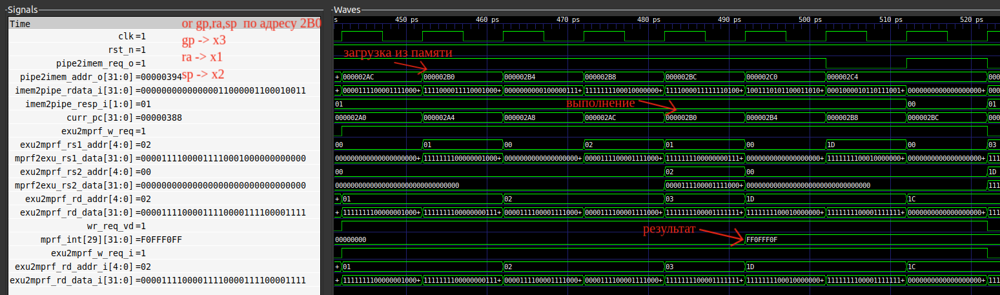

# Отчет о лабораторной работе №3

## Цель работы
Познакомиться с архитектурой пайплайна SCR1. Доработать тестбенч для вывода информации об микроархитектурном состоянии и состоянии конвеера при выполении определенной команды.

## Вариант задания

| Номер варианта | ФИО                | Исследуемая команда | Отладочная информация |
|----------------|--------------------|---------------------|-----------------------|
| 4              | Всеволод Суровикин | or                  | Вывести PC            |

## Ход работы

Необходимо проанализировать работу команды `or` в пайплайне процессора. Доработать тестовое окружение таким образом, чтобы при выполнении команды `or` в терминал выводилось сообщение "detected OR command" и текущее значение PC.

### Конфигурация тестов

Сначала отредактируем список тестов, которые должны запускаться в файле `rv32_tests.inc`:

```
ARCH_lowercase = $(shell echo $(ARCH) | tr A-Z a-z)

rv32_isa_tests += isa/rv32mi/or.S
```

Для запуска тестов с формированием временной диаграммы воспользуемся следующей командой:

```
make run_verilator_wf TARGETS="riscv_isa" TRACE=1
```

Важно отметить, что для запуска тестов с предоставленным тулчейном необходимо было отредактировать `Makefile` для компиляции теста следующим образом:

```
CFLAGS := -I$(inc_dir) -I$(src_dir) -DASM -Wa,-march=rv32$(ARCH) -march=rv32$(ARCH) -mabi=ilp32f -D__riscv_xlen=32
LDFLAGS := -static -fvisibility=hidden -nostdlib -nostartfiles -T$(inc_dir)/link.ld -march=rv32$(ARCH) -mabi=ilp32f
```

Изменения были во флагах компилятора, а именно в флаге `-march`, где было убрано расширение `_zifencei`, так как предоставленная версия тулчейна не поддерживает данное расширение.

Это расширение определяет инструкцию FENCE.I, которая предоставляет явную синхронизацию для доступа к памяти инструкций.

### Просмотр временной диаграммы 

С помощью программы `GTKWave` просмотрим сгенерированную временную диаграмму `simx.vcd`. Выведем сигналы:
* `clk` - тактовый импульс
* `curr_pc` - текущее значение счетчика команд, соответствует стадии Execution
* набор сигналов для Instruction Fetch:
  * `imem_req` - запрос от процессора в память инструкций
  * `imem_addr` - адрес запроса памяти инструкций
  * `imem_resp` - ответ памяти инструкций
  * `imem_rdata` - данные чтения памяти инструкций

, а также другие сигналы, отражающие работу пайплайна на стадии Execute. Будем смотреть выполнение инструкции  `2b0:  0020e1b3  or  gp,ra,sp`.



Как можно увидеть, сначала загружается инструкция из памяти, затем через несколько тактов она исполняется, и результат можно увидеть по адресу регистра `x3`. 

### Несинтезируемый блок

Далее переходим в директорию `src/tb/` и создаем несинтезируемый блок, который будет нам выводить информацию о PC каждый раз, когда из памяти грузится инструкция `or`. Блок будет иметь следующий вид:

```
module scr1_tb_log_cmd();

always_ff @(posedge scr1_top_tb_ahb.i_top.i_imem_ahb.clk) begin
    if (scr1_top_tb_ahb.i_top.i_imem_ahb.imem_resp == 2'b01) begin
        // valid data from ahb router
        if (
            (scr1_top_tb_ahb.i_top.i_imem_ahb.imem_rdata[6 : 0] == 7'b0110011) &
            (scr1_top_tb_ahb.i_top.i_imem_ahb.imem_rdata[14 : 12] == 3'b110)
        ) begin
            // detect or command
            $display("Detect OR command, pc counter: %h", scr1_top_tb_ahb.i_top.i_core_top.i_pipe_top.curr_pc[31 : 0]);
        end
    end
end

endmodule
```

Здесь мы проверяем загружаемую инструкцию на наличие операционного кода, соответсвующего команде `or`. При нахождении мы выводим сообщение о том, что обнаружили инструкцию и рядом мы выводим значение регистра PC. 

Затем мы перекомпилируем проект и попробуем его запустить. После запуска мы получаем следующий вывод:

```
scr1_top_tb_ahb
---Test:                           or.hex
Detect OR command, pc counter: 000002a8
Detect OR command, pc counter: 00000324
Detect OR command, pc counter: 00000360
Detect OR command, pc counter: 00000384
Detect OR command, pc counter: 00000384
Detect OR command, pc counter: 000003b2
Detect OR command, pc counter: 000003b2
Detect OR command, pc counter: 000003e0
Detect OR command, pc counter: 000003e0
Detect OR command, pc counter: 0000043c
Detect OR command, pc counter: 0000043c
Detect OR command, pc counter: 000004f0
Detect OR command, pc counter: 000004f0
Detect OR command, pc counter: 00000544
Detect OR command, pc counter: 00000544
Detect OR command, pc counter: 000005f8
Detect OR command, pc counter: 000005f8
Detect OR command, pc counter: 00000618
Detect OR command, pc counter: 00000646
Detect OR command, pc counter: 00000660
Test passed

#--------------------------------------
# Summary: 1/1 tests passed
#--------------------------------------

- /home/vsevolod/ITMO/SoC/SoC_lab2/scr1/src/tb/scr1_top_tb_runtests.sv:199: Verilog $finish
```

Из сообщения можно сделать вывод, что написанный блок корректно находит команду `or` и выводит значение регистра PC.

## Вывод

Данная работа позволила подробно изучить, как работает пайплайн в проекте SCR1.
